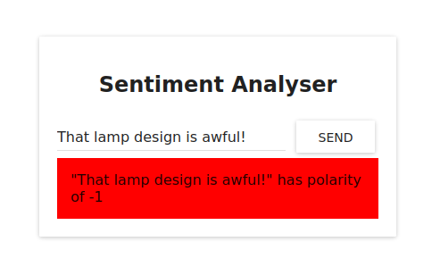
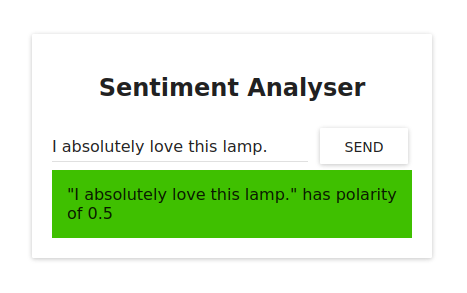
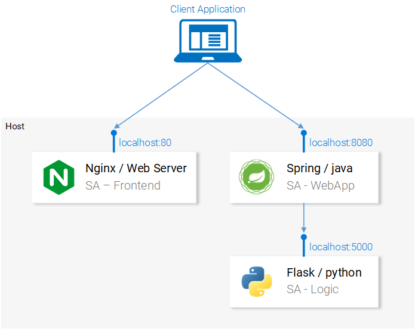

Guided AKS/K8 practice using the amazing [write-up here](https://www.freecodecamp.org/news/learn-kubernetes-in-under-3-hours-a-detailed-guide-to-orchestrating-containers-114ff420e882/), ported to Azure from Minikube.

This is a sentiment analysis application that reads a user-provided string and determines the [polarity score](https://en.wikipedia.org/wiki/Sentiment_analysis#Types) 

Example #1: 


Example #2: 


# Current Application Architecture
- Frontend: deployment of 2 replica pods each running 1 Nginx container image 
- Application: deployment of 1 pod running 1 simple Java application container image
- Backend Logic: deployment of 1 pod running 1 simple Python container image
- Services: Load balancers for each tier




# Development Environment
- Ubuntu 21.10 VM running in Virtualbox
- Terraform Cloud to store Azure environment variables and Terraform state
- Terraform CLI to deploy Azure infrastructure
- [Azure CLI](https://docs.microsoft.com/en-us/cli/azure/install-azure-cli-linux?pivots=apt) 
  - Note: When following the installation documentation for Ubuntu 21.10, you may need to perform the following on step 3, "Add the Azure CLI software repository" : Change `impish main` in /etc/apt/sources.list.d/azure-cli.list to `bionic main`
- [Kutectl](https://docs.microsoft.com/en-us/azure/aks/kubernetes-walkthrough)
- All the tooling specified in the FreeCodeCamp write-up linked above

# Gotchas
- Replace all instances of `codetantrum` with your Docker Hub user name so that any changes made to container images can be deployed to a repository you have access to. This is required for the gotcha below.
- There is a line in sa-frontend/src/App.js that specifies where to send the HTTP POST for the `analyzeSentence` function. Once everything is deployed, use kubectl to get the external IP address of sa-web-app-lb. Update this line with the collected information. Then, rebuild and redeploy the image. These steps are outlined below.
```javascript
analyzeSentence() {
        fetch('http://52.226.215.108:80/sentiment', {  // Change me
            method: 'POST',
            headers: {
                'Content-Type': 'application/json'
            },
            body: JSON.stringify({sentence: this.textField.getValue()})
        })
            .then(response => response.json())
            .then(data => this.setState(data));
    }
```

```commandline
# move to sa-frontend/ and rebuild the frontend
$ npm run build

# build the updates docker image 
$ docker build -f Dockerfile -t codetantrum/sentiment-analysis-frontend .

# push the docker image to your Hub repository
$ docker push codetantrum/sentiment-analysis-frontend

# redeploy sa-frontend with the updated image
$ kubectl rollout restart deployment sa-frontend
```

# To Do
...